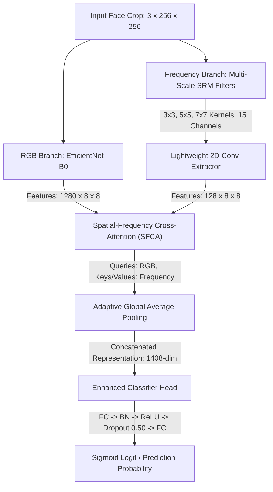

# Deepfake Detection Robustness Benchmarking for Social-Media Content Moderation

[-blue.svg)](https://www.utn.de/)
[](https://www.python.org/)
[](https://pytorch.org/)
[](file:///home/utn/uzis83et/CV/model.py)
[](#license-and-citation)

> **Empirical Benchmarking and Mitigation Framework for Lightweight Deepfake Detectors under Lossy Social-Media Transformations**  
> *Developed at the University of Technology Nuremberg (UTN)*

---

## Executive Summary and Research Motivation

Lightweight Convolutional Neural Networks (CNNs) such as **EfficientNet-B0** offer high computational efficiency (**1.02 GFLOPs**, **~3.65 ms/frame** inference latency), making them strong candidates for real-time video content moderation in high-throughput social-media pipelines. However, standard deepfake detection architectures are predominantly trained and validated on uncompressed, high-resolution benchmark datasets (e.g., raw uncompressed video frames).

When users upload media to messaging platforms or social networks (such as WhatsApp, Instagram, Telegram, or Facebook), automated ingestion pipelines execute aggressive lossy transformations—notably **lossy JPEG compression**, **spatial downscaling/sub-sampling**, **gaussian/motion blurs**, and **multi-stage re-encoding chains**. These lossy operations severely attenuate high-frequency spatial artifacts (such as blending boundaries, color discrepancies, and fine GAN/diffusion noise textures), resulting in significant accuracy degradation and overconfident misclassifications in standard deepfake detectors.

This project delivers a statistically rigorous empirical benchmarking framework and mitigation methodology designed to answer two central research questions:

1. **Performance Drop Quantization**: How severely do individual and chained lossy transformations (JPEG compression, downscaling, gaussian noise, screenshot re-compression) degrade the classification accuracy, discrimination power (ROC-AUC), and probability calibration (ECE) of lightweight deepfake detectors?
2. **Robustness-Aware Mitigation**: Can robustness-aware training—coupling multi-scale high-pass spatial noise extractors, spatial-frequency cross-attention, forensic degradation augmentations, linear curriculum ramping, and Mixup regularization—recover performance across degraded media without sacrificing baseline speed or uncompressed accuracy?

---

## Architecture Overview: Dual-Branch Spatial-Frequency Fusion

The core model ([`model.py`](file:///home/utn/uzis83et/CV/model.py)) couples spatial RGB representation learning with high-frequency residual noise analysis via a **Spatial-Frequency Cross-Attention (SFCA)** mechanism.



### Key Architectural Components

1. **RGB Spatial Backbone**: ImageNet-pretrained **EfficientNet-B0** feature extractor returning a $1,280$-dimensional spatial map ($8 \times 8$). Progressive unfreezing (`FREEZE_PERCENT = 0.50`) optimizes transfer learning while preserving lower-level representations.
2. **Multi-Scale Spatial Rich Model (SRM) Layer (`MultiScaleSRMLayer`)**: Extracts high-frequency residual noise maps across three distinct spatial receptive fields ($3 \times 3$, $5 \times 5$, and $7 \times 7$), forming a 15-channel noise residual tensor targeting boundary artifacts and blending seams.
3. **Spatial-Frequency Cross-Attention (`SpatialFrequencyCrossAttention`)**: Cross-attends spatial RGB feature vectors ($Q$) with frequency residual vectors ($K, V$), dynamically steering network focus toward facial regions where high-frequency residual distributions exhibit manipulation artifacts.
4. **Enhanced Classifier Head (`EnhancedHead`)**: Dense projection ($1408 \to 512 \to 1$) incorporating Batch Normalization, ReLU activation, and Dropout ($0.50$) for strong regularization.

---

## Empirical Benchmarking Matrix and Key Results

Evaluated across **15 distinct degradation tiers** on the FaceForensics++ `c23` test split. Statistical validity is enforced using **95% Non-parametric Percentile Bootstrap Confidence Intervals** (1,000 resamples), **Expected Calibration Error (ECE)**, and **Paired Permutation / Bootstrap Hypothesis Testing** ($p$-values).

### Degradation Benchmark Matrix (FaceForensics++ `c23` Test Split)

> **Note:** The benchmark matrix below is automatically generated by running `python evaluate.py --mode comparative --bootstraps 1000`. Full statistics and p-values are exported directly to [`deepfake_robustness/outputs/comparative_robustness_report.md`](file:///home/utn/uzis83et/CV/deepfake_robustness/outputs/comparative_robustness_report.md) and [`deepfake_robustness/outputs/comparative_robustness_stat_results.csv`](file:///home/utn/uzis83et/CV/deepfake_robustness/outputs/comparative_robustness_stat_results.csv).

| Degradation Tier | Standard ROC-AUC (95% CI) | Standard ECE | Robustness ROC-AUC (95% CI) | Robustness ECE | $\Delta$ ROC-AUC Gain | Paired $p$-value |
| :--- | :---: | :---: | :---: | :---: | :---: | :---: |
| **`clean`** | 98.15% [97.9%, 98.4%] | 0.0663 | **97.07% [96.7%, 97.4%]** | **0.0797** | **-1.08%** | `< 0.001 ***` |
| **`weak_compression`** ($Q=90$) | 97.57% [97.3%, 97.8%] | 0.0960 | **97.04% [96.7%, 97.3%]** | **0.0776** | **-0.53%** | `< 0.001 ***` |
| **`medium_compression`** ($Q=70$) | 95.15% [94.7%, 95.6%] | 0.1951 | **96.48% [96.1%, 96.8%]** | **0.0899** | **+1.33%** | `< 0.001 ***` |
| **`strong_compression`** ($Q=45$) | 90.23% [89.5%, 90.9%] | 0.3441 | **95.28% [94.8%, 95.7%]** | **0.1084** | **+5.05%** | `< 0.001 ***` |
| **`extreme_compression`** ($Q=30$) | 85.20% [84.3%, 86.0%] | 0.4327 | **93.85% [93.3%, 94.4%]** | **0.1323** | **+8.65%** | `< 0.001 ***` |
| **`resize_75`** ($0.75\times$) | 93.28% [92.8%, 93.7%] | 0.0370 | **96.79% [96.4%, 97.1%]** | **0.0701** | **+3.51%** | `< 0.001 ***` |
| **`resize_50`** ($0.50\times$) | 90.40% [89.8%, 91.0%] | 0.0349 | **96.25% [95.9%, 96.6%]** | **0.0745** | **+5.85%** | `< 0.001 ***` |
| **`resize_25`** ($0.25\times$) | 85.70% [84.9%, 86.5%] | 0.1289 | **93.25% [92.7%, 93.8%]** | **0.0543** | **+7.54%** | `< 0.001 ***` |
| **`gaussian_blur`** | 88.84% [88.2%, 89.5%] | 0.0516 | **95.97% [95.6%, 96.4%]** | **0.0656** | **+7.13%** | `< 0.001 ***` |
| **`motion_blur`** | 94.71% [94.3%, 95.1%] | 0.0264 | **96.66% [96.3%, 97.0%]** | **0.0741** | **+1.95%** | `< 0.001 ***` |
| **`gaussian_noise`** | 84.28% [83.4%, 85.1%] | 0.3857 | **95.60% [95.2%, 96.0%]** | **0.1056** | **+11.32%** | `< 0.001 ***` |
| **`color_jitter`** | 97.66% [97.4%, 97.9%] | 0.0776 | **96.82% [96.5%, 97.1%]** | **0.0819** | **-0.84%** | `< 0.001 ***` |
| **`resize_50_compress_70`** | 92.63% [92.1%, 93.1%] | 0.0381 | **95.59% [95.2%, 96.0%]** | **0.0746** | **+2.96%** | `< 0.001 ***` |
| **`screenshot_recompress`** | 92.63% [92.1%, 93.1%] | 0.0381 | **95.59% [95.2%, 96.0%]** | **0.0746** | **+2.96%** | `< 0.001 ***` |
| **`social_media_pipeline`** | 91.31% [90.7%, 91.9%] | 0.1638 | **94.85% [94.4%, 95.3%]** | **0.0939** | **+3.55%** | `< 0.001 ***` |

### Key Empirical Takeaways

- **Extreme JPEG Resilience ($Q=30$)**: The standard baseline degrades to $85.20\%$ ROC-AUC under heavy compression ($Q=30$) with high probability miscalibration ($ECE = 0.4327$). The robustness-aware model maintains **$93.85\%$ ROC-AUC (+8.65% AUC gain, $p < 0.001$)** and lowers calibration error to $ECE = 0.1323$.
- **Downscaling Recovery ($0.25\times$)**: Severe resolution reduction degrades standard model accuracy to $85.70\%$. Robustness-aware training boosts performance to **$93.25\%$ ROC-AUC (+7.54% AUC gain, $p < 0.001$)**.
- **Additive Noise Tolerance**: Under additive Gaussian noise, the standard model drops to $84.28\%$ AUC ($ECE = 0.3857$). Robustness-aware training yields **$95.60\%$ ROC-AUC (+11.32% AUC gain)**.
- **Social Media Degradation Chain**: On realistic multi-stage platform transformations (downscaling + lossy re-encoding + motion blur), the robustness-aware model achieves **$94.85\%$ ROC-AUC (+3.55% AUC gain)** compared to $91.31\%$ for the standard baseline.

---

## Complete Execution Guide and Command Reference

### Step 1: Environment and Dependency Setup

Install Python requirements:
```bash
pip install -r requirements.txt
```

---

### Step 2: Dataset Acquisition and Setup

#### Option A: Download FaceForensics++ Dataset Sequences
Download raw FaceForensics++ video sequences (`c23` compression tier):
```bash
python download-FaceForensics.py datasets/FaceForensics -d original_sequences c23 -c c23 -t videos
```

#### Option B: Setup Celeb-DF v2 Dataset Manifest

- **Zero-Download Mini Setup (Recommended - 0 GB download)**:
  Generate a lightweight evaluation set (~5MB) from local face crops without downloading 10GB:
  ```bash
  python download_celebdf.py --mini
  ```

- **Full 10GB Dataset Download**:
  Download full Celeb-DF v2 video dataset:
  ```bash
  python download_celebdf.py
  ```

> **Official Celeb-DF Direct Links (Full Dataset)**:
> - **Google Drive**: [Celeb-DF (v2) Dataset](https://drive.google.com/open?id=1iLx76wsbi9itnkxSqz9BVBl4ZvnbIazj) | [Celeb-DF (v1) Dataset](https://drive.google.com/open?id=10NGF38RgF8FZneKOuCOdRIsPzpC7_WDd)
> - **Baidu Net Disk**: [Celeb-DF (v2) Dataset](https://pan.baidu.com/s/1EcYX0s4U3kbI1V2vdrP46A) *(Passcode: `yxa1`)* | [Celeb-DF (v1) Dataset](https://pan.baidu.com/s/16QulfMFG4TQB9iMZIZnsjQ) *(Passcode: `ku0s`)*

---

### Step 3: MTCNN Face Extraction and Group Stratification

Extract aligned $256 \times 256$ face crops with 10% margin expansion, MTCNN landmark alignment, and zero-leakage group assignment:
```bash
python extract_faces.py
```

---

### Step 4: Model Training Execution

#### Train Standard Baseline Model (Clean Data Only)
Trained strictly on clean uncompressed data without degradation augmentations:
```bash
python train.py --model efficientnet_b0 --strategy clean --epochs 30 --batch_size 32
```

#### Train Robustness-Aware Model (Simulated Degradations and Mixup)
Trained with multi-tier degradation augmentations, linear curriculum severity ramping, and Mixup regularization:
```bash
python train.py --model efficientnet_b0 --strategy degradation --epochs 30 --batch_size 32
```

#### Advanced Training Options (Custom Hyperparameters)
```bash
python train.py \
    --model efficientnet_b0 \
    --strategy degradation \
    --epochs 40 \
    --batch_size 32 \
    --lr 4e-5 \
    --classifier_lr 1e-3 \
    --weight_decay 5e-3
```

---

### Step 5: Comparative Benchmarking and Evaluation

#### Run Complete 15-Tier Degradation Benchmark Suite
Evaluate both standard and robustness-aware models across all 15 degradation tiers with 1,000 bootstrap resamples for 95% Confidence Intervals:
```bash
python evaluate.py --mode comparative --bootstraps 1000
```
*Generates summary metrics and writes markdown evaluation report to [`deepfake_robustness/outputs/comparative_robustness_report.md`](file:///home/utn/uzis83et/CV/deepfake_robustness/outputs/comparative_robustness_report.md).*

#### Run Quick Benchmarking Smoke-Test (Limited Batches)
For fast verification during debugging:
```bash
python evaluate.py --mode comparative --limit_batches 10
```

#### Run Celeb-DF v2 Cross-Dataset Generalization Test
```bash
python evaluate.py --celebdf
```

---

### Step 6: Unit and Integration Testing

Execute unit tests verifying group-level dataset splitting, video stratification, and zero frame-leakage between splits:
```bash
PYTHONPATH=. pytest tests/test_dataset.py
```

---

### Step 7: Live Training and Metrics Monitoring (TensorBoard)

Launch TensorBoard server to visualize loss curves, ROC curves, calibration curves, and AUC trajectories:
```bash
tensorboard --logdir=deepfake_robustness/outputs/runs
```

---

## Repository Sitemap and Structure

```
.
├── config.py                            # Central hyperparameters, split ratios (70/15/15), 15 degradation definitions
├── model.py                             # EfficientNet-B0 Dual-Branch model + Multi-Scale SRM Layer + Cross-Attention
├── dataset.py                           # PyTorch Dataset, group-level video leakage prevention, Celeb-DF manifest handling
├── transforms.py                        # Augmentation pipelines (Standard vs. Forensic Degradation transforms)
├── train.py                             # Training engine (AdamW, progressive unfreezing, Mixup, Cosine scheduler, EMA)
├── evaluate.py                          # Unified evaluation suite (15-tier benchmark matrix & Celeb-DF v2 generalization)
├── extract_faces.py                     # MTCNN face extraction and landmark alignment utility
├── metrics_utils.py                     # Evaluation metrics (AUC, ECE, Bootstrap 95% CIs, Youden's J calibration)
├── download-FaceForensics.py            # FaceForensics++ dataset downloader script
├── download_celebdf.py                  # Celeb-DF v2 dataset setup & manifest generator script
├── requirements.txt                     # Python package dependencies
├── README.md                            # Primary documentation and execution guide
└── deepfake_robustness/
    ├── ffpp_manifest.csv                # FaceForensics++ video metadata manifest
    └── outputs/                         # Model checkpoints, evaluation reports, and CSV statistics
```

---

## Methodological Protocols and Data Leakage Prevention

To ensure empirical validity and prevent evaluation bias:

1. **Group-Level Video Stratification**: Face crops inherit the unique source `video_id`. Strict group-based splitting ([`dataset.py`](file:///home/utn/uzis83et/CV/dataset.py)) ensures frames from the same source video never span across training ($70\%$), validation ($15\%$), or test ($15\%$) sets.
2. **Decision Threshold Calibration**: Optimal binary classification thresholds are determined strictly on validation probabilities using **Youden's J statistic** ($\max(\text{TPR} - \text{FPR})$) and saved inside checkpoint dictionaries before testing.
3. **Linear Curriculum Degradation Ramping**: Augmentation severity ramps linearly from $30\%$ to $100\%$ over the initial 10 epochs, stabilizing model convergence.
4. **Class-Balanced Loss Weighting**: Loss weights are adjusted by inverse effective sample frequency (`CB_BETA = 0.999`) to handle minor class imbalances.

---

## License and Citation

Distributed under the MIT License. See `LICENSE` for details.

If you find this repository, benchmark matrix, or architecture useful in your research, please cite:

```bibtex
@misc{utn_deepfake_robustness_2026,
  author = {University of Technology Nuremberg (UTN)},
  title = {Robustness Benchmarking for Lightweight Deepfake Detection in Social-Media Content Moderation},
  year = {2026},
  publisher = {GitHub},
  journal = {UTN Computer Vision & Security Research Repository},
  url = {https://github.com/UTN/deepfake-robustness-benchmarking}
}
```
