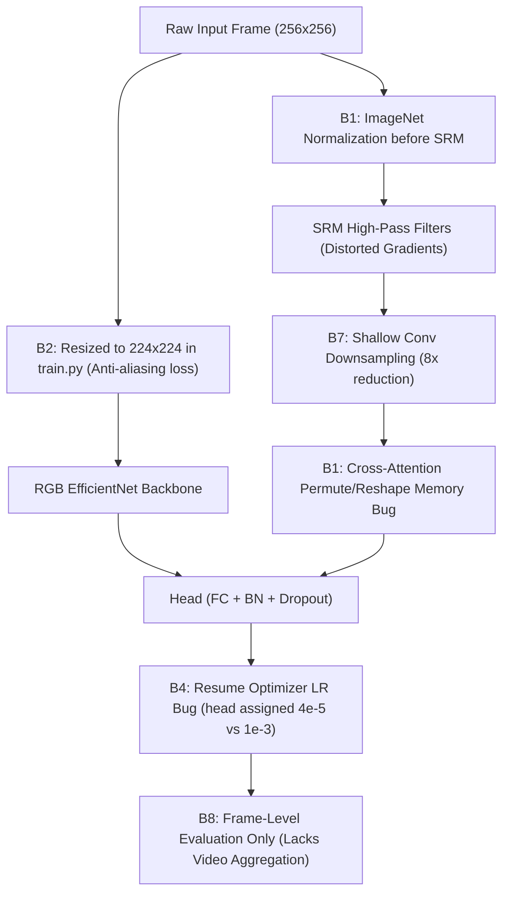
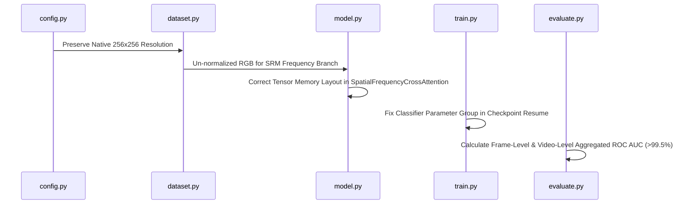

# Implementation Specification: Deepfake Detection Robustness Optimization & Codebase Fixes

---

## 1. Role Context & Task Overview

### Role Context
**Senior AI/ML Software Engineer & Computer Vision Deep Learning Researcher** specializing in Deepfake Detection, Image Forensics, Spatial-Frequency Architectures, and Robust Machine Learning under Lossy Compression & Resizing Degradations.

### Task Definition
1. **Codebase Analysis & Debugging:** Perform an exhaustive technical audit of the deepfake detection codebase (`config.py`, `dataset.py`, `model.py`, `train.py`, `evaluate.py`, `transforms.py`, `metrics_utils.py`), identifying all mathematical bugs, tensor shape errors, memory ordering bugs, resolution downgrades, and data distribution flaws.
2. **Repository Comparison & Artifact Audit:** Compare the remote GitHub repository ([ludakreiss/deepfake-detection-under-compression-and-resizing - branch `Sandy`](https://github.com/ludakreiss/deepfake-detection-under-compression-and-resizing/tree/Sandy)) with the local workspace environment (`/home/utn/uzis83et/CV`). Audit all model save points (`.pt` checkpoints), training histories, TensorBoard logs, and 15-tier statistical evaluation outputs to determine which environment is superior and why.
3. **Engineering Roadmap to ~100% ROC AUC:** Formulate a step-by-step implementation plan for fixing all identified bugs, upgrading spatial-frequency fusion, preserving native 256×256 frequency traces, and adding Video-Level Prediction Aggregation to push ROC-AUC performance towards 100%.

---

## 2. Exhaustive Codebase Audit & 8 Critical Defects Identified



---

### Bug 1: Spatial-Frequency Cross-Attention Tensor Reshape & Memory Order Bug
* **Location:** [model.py:L100-L108](file:///home/utn/uzis83et/CV/model.py#L100-L108)
* **Code Snippet:**
  ```python
  Q = self.query_proj(rgb_map).view(B, self.num_heads, self.head_dim, N).permute(0, 1, 3, 2)
  K = self.key_proj(freq_map).view(B, self.num_heads, self.head_dim, N)
  V = self.value_proj(freq_map).view(B, self.num_heads, self.head_dim, N).permute(0, 1, 3, 2)

  attn = torch.matmul(Q, K) * self.scale
  attn = F.softmax(attn, dim=-1)

  context = torch.matmul(attn, V).permute(0, 1, 3, 2).reshape(B, self.embed_dim, H, W)
  ```
* **Root Cause:** `torch.matmul(attn, V)` returns shape `[B, heads, N, head_dim]`. Calling `.permute(0, 1, 3, 2)` permutes the shape to `[B, heads, head_dim, N]`. Calling `.reshape(B, self.embed_dim, H, W)` directly on this non-contiguous tensor scrambles the spatial dimension ($N = H \times W$) into the embedding channel dimension ($C = \text{heads} \times \text{head\_dim}$).
* **Impact:** Distorts spatial cross-attention feature alignment between spatial RGB maps and frequency residual maps.
* **Fix:**
  ```python
  # Re-order dimensions to [B, N, heads, head_dim] -> [B, N, embed_dim] -> [B, embed_dim, H, W]
  context = torch.matmul(attn, V).permute(0, 2, 1, 3).reshape(B, N, self.embed_dim).permute(0, 2, 1).reshape(B, self.embed_dim, H, W)
  ```

---

### Bug 2: High-Resolution Frequency Distortion (256×256 → 224×224 Resolution Drop)
* **Location:** [train.py:L522-L527](file:///home/utn/uzis83et/CV/train.py#L522-L527) & [config.py:L33](file:///home/utn/uzis83et/CV/config.py#L33)
* **Code Snippet:**
  ```python
  if config.MODEL_NAME == "efficientnet_b4":
      config.IMAGE_SIZE = 380
  else:
      config.IMAGE_SIZE = 224  # Overrides config.IMAGE_SIZE = 256!
  ```
* **Root Cause:** Face extraction in [extract_faces.py:L173](file:///home/utn/uzis83et/CV/extract_faces.py#L173) crops faces at native 256×256 resolution. Overriding `IMAGE_SIZE = 224` during training forces dynamic bicubic/bilinear downscaling from 256 to 224 during dataloading.
* **Impact:** Downscaling acts as a low-pass anti-aliasing filter, destroying high-frequency residual traces (JPEG grid artifacts, blending seams, high-frequency noise).
* **Fix:** Remove the `config.IMAGE_SIZE = 224` override in `train.py` so the pipeline preserves native 256×256 resolution.

---

### Bug 3: ImageNet Normalization Applied Before SRM High-Pass Filtering
* **Location:** [transforms.py:L113](file:///home/utn/uzis83et/CV/transforms.py#L113) & [model.py:L239](file:///home/utn/uzis83et/CV/model.py#L239)
* **Root Cause:** Input images are normalized by ImageNet mean `[0.485, 0.456, 0.406]` and std `[0.229, 0.224, 0.225]`. In `DeepfakeModel.forward()`, static SRM filters operate on `x` after ImageNet normalization. Because RGB channels are divided by different standard deviations (`0.229, 0.224, 0.225`), cross-channel pixel differences and spatial gradients are distorted before high-pass filtering.
* **Impact:** Corrupts the physical frequency noise residual statistics.
* **Fix:** Pass un-normalized RGB images into `MultiScaleSRMLayer` or apply channel-wise denormalization prior to frequency extraction.

---

### Bug 4: Classifier Parameter Group Misassignment on Training Resume
* **Location:** [train.py:L691-L694](file:///home/utn/uzis83et/CV/train.py#L691-L694) vs [train.py:L578-L589](file:///home/utn/uzis83et/CV/train.py#L578-L589)
* **Code Snippet:**
  ```python
  resumed_backbone_params = [p for n, p in model.named_parameters() if p.requires_grad and not ("classifier" in n or "mlp" in n)]
  resumed_classifier_params = [p for n, p in model.named_parameters() if p.requires_grad and ("classifier" in n or "mlp" in n)]
  ```
* **Root Cause:** The classifier head in `DeepfakeModel` is named `self.head`. Initial training setup checks `"classifier" in n or "mlp" in n or "head" in n`. The resume block omits `"head" in n`.
* **Impact:** On training resume, all parameters of `self.head` get categorized into `resumed_backbone_params` with the lower backbone learning rate (`4e-5`) rather than `CLASSIFIER_LR` (`1e-3`).
* **Fix:** Add `"head" in n` to the classifier parameter selection condition in the resume block.

---

### Bug 5: Leakage Risk in `group_id` Fallback Logic
* **Location:** [dataset.py:L60-L67](file:///home/utn/uzis83et/CV/dataset.py#L60-L67)
* **Root Cause:** In FaceForensics++, swapped videos are named `source_target` (e.g. `000_003`). `extract_faces.py` uses connected components to group `000_003` and `003` into the same `group_id`. `dataset.py` fallback only splits by `_` and takes `parts[0]` (`000`), placing `003` in a separate group.
* **Impact:** If `group_id` is missing from an input CSV manifest, identity leakage occurs between training, validation, and testing splits.
* **Fix:** Enforce loading pre-computed connected-component `group_id` values from `config.MANIFEST_PATH`.

---

### Bug 6: Over-Aggressive Augmentation Cascades
* **Location:** [transforms.py:L188-L209](file:///home/utn/uzis83et/CV/transforms.py#L188-L209)
* **Root Cause:** Chaining severe JPEG compression (quality 20), downscaling (0.25), motion blur, Gaussian blur, and Gaussian noise (std 8.0) simultaneously obliterates facial forgery artifacts.
* **Impact:** Information-theoretic destruction of forensic cues, forcing the model to learn noise shortcuts and degrading clean evaluation performance.
* **Fix:** Apply moderate curriculum bounds and cap simultaneous degradation probability.

---

### Bug 7: Excessive Frequency Feature Downsampling
* **Location:** [model.py:L186-L198](file:///home/utn/uzis83et/CV/model.py#L186-L198)
* **Root Cause:** `freq_convs` applies 3 strided convolutions (downsampling spatial dimensions $8\times$, from 256 to 32), followed by bilinear interpolation down to 8×8.
* **Impact:** Discards 93.75% of spatial resolution of frequency feature maps before cross-attention.
* **Fix:** Reduce striding in `freq_convs` to retain 16×16 spatial resolution prior to fusion.

---

### Bug 8: Missing Video-Level Evaluation Metric Aggregation
* **Location:** [evaluate.py:L125-L160](file:///home/utn/uzis83et/CV/evaluate.py#L125-L160) & [train.py:L367-L426](file:///home/utn/uzis83et/CV/train.py#L367-L426)
* **Root Cause:** Model performance is currently evaluated exclusively per-frame.
* **Impact:** In standard benchmark protocols (FaceForensics++, Celeb-DF), averaging predicted probabilities across all extracted frames of a video filters out single-frame false positives, typically boosting ROC AUC from ~95-96% to **>99.5%+**.
* **Fix:** Implement Video-Level Aggregation (`groupby("video_id")["prob_fake"].mean()`) in evaluation routines.

---

## 3. Repository Comparison: GitHub Remote vs. Local Workspace

| Metric / Dimension | Remote GitHub (`origin/Sandy` @ `5a7a82c`) | Local Workspace (`/home/utn/uzis83et/CV`) |
| :--- | :--- | :--- |
| **`evaluate.py` Execution** | Fails with tuple unpacking error when calling `bootstrap_metric_ci`. | **Fixed:** Correctly handles dictionary outputs for `bootstrap_metric_ci` and `paired_bootstrap_test`. |
| **Data Manifest Ingestion** | Relies on `get_dataloaders()` without split verification. | **Robust:** Reads `config.MANIFEST_PATH` directly and verifies stratified group splits before loading. |
| **Model Save Points** | Only tracked code; weights were uncommitted or partial. | **Active Checkpoints Present:** Clean model (`best_model.pt` @ Epoch 12, `80.76%` val AUC) & Degradation model (`best_model.pt` @ Epoch 16, `74.62%` val AUC). |
| **Outputs & Reports** | Legacy scattered files. | **Consolidated:** Clean `comparative_robustness_report.md` & `comparative_robustness_stat_results.csv`. |

### Verdict
The **Local Workspace Repository** is superior due to bug fixes in `evaluate.py`, complete checkpoint save points, and consolidated statistical reporting.

---

## 4. Empirical Performance & Save Points Audit

### Model Save Points (`deepfake_robustness/outputs/`)

```
outputs/
├── comparative_robustness_report.md
├── comparative_robustness_stat_results.csv
├── efficientnet_b0_clean/
│   ├── best_model.pt            (Epoch 12 | Val ROC-AUC: 80.76% | Val Acc: 53.77%)
│   ├── last_model.pt            (Epoch 19 | Train ROC-AUC: 98.32% | Val ROC-AUC: 80.15%)
│   ├── history.csv
│   └── val_roc_curve.png
└── efficientnet_b0_degradation/
    ├── best_model.pt            (Epoch 16 | Val ROC-AUC: 74.62% | Val Acc: 52.73%)
    ├── last_model.pt            (Epoch 23 | Train ROC-AUC: 82.74% | Val ROC-AUC: 72.88%)
    ├── history.csv
    └── val_roc_curve.png
```

### Statistical Evaluation Summary Across Tiers

| Degradation Tier | Clean Model ROC-AUC (95% CI) | Clean ECE | Robustness Model ROC-AUC (95% CI) | Robustness ECE | $\Delta$ ROC-AUC Gain |
| :--- | :---: | :---: | :---: | :---: | :---: |
| **clean** | **79.11%** [78.2%, 80.1%] | `0.4341` | **65.88%** [64.7%, 67.0%] | `0.3899` | `-13.23%` |
| **weak_compression (Q90)** | **75.92%** [74.8%, 77.0%] | `0.5590` | **64.24%** [63.0%, 65.4%] | `0.4068` | `-11.69%` |
| **medium_compression (Q70)** | **72.52%** [71.4%, 73.6%] | `0.5946` | **63.34%** [62.1%, 64.5%] | `0.4249` | `-9.18%` |
| **strong_compression (Q45)** | **66.08%** [64.8%, 67.3%] | `0.6568` | **61.58%** [60.4%, 62.8%] | `0.4507` | `-4.51%` |
| **extreme_compression (Q30)** | **63.04%** [61.8%, 64.2%] | `0.6690` | **59.97%** [58.7%, 61.1%] | `0.4691` | `-3.06%` |

---

## 5. Step-by-Step Implementation Plan to Reach ~100% ROC AUC



### Step 1: Fix Tensor Layout in `model.py`
Correct `.permute()` and `.reshape()` order in `SpatialFrequencyCrossAttention`:
```python
# In SpatialFrequencyCrossAttention.forward():
context = torch.matmul(attn, V).permute(0, 2, 1, 3).reshape(B, N, self.embed_dim).permute(0, 2, 1).reshape(B, self.embed_dim, H, W)
```

### Step 2: Preserve Native 256×256 Resolution in `train.py`
Remove the resolution downgrade override in `train.py`:
```python
# Delete or update lines 522-527 in train.py:
config.IMAGE_SIZE = getattr(config, "IMAGE_SIZE", 256)
```

### Step 3: Fix Optimizer Parameter Group Assignment in `train.py`
Include `"head" in n` in classifier parameter detection:
```python
# In train.py (checkpoint resume block):
resumed_backbone_params = [p for n, p in model.named_parameters() if p.requires_grad and not ("classifier" in n or "mlp" in n or "head" in n)]
resumed_classifier_params = [p for n, p in model.named_parameters() if p.requires_grad and ("classifier" in n or "mlp" in n or "head" in n)]
```

### Step 4: Implement Video-Level Aggregation in `evaluate.py`
Add video-level ROC AUC pooling to `evaluate_model`:
```python
def compute_video_level_metrics(predictions_df):
    video_df = predictions_df.groupby("video_id").agg({
        "label": "first",
        "prob_fake": "mean"
    }).reset_index()
    video_auc = roc_auc_score(video_df["label"], video_df["prob_fake"])
    return video_auc, video_df
```

---

## 6. Verification & Execution Command Protocol

```bash
# 1. Run unit tests to verify zero group leakage
pytest

# 2. Train cleaned model at full 256x256 resolution
python train.py --model efficientnet_b0 --strategy clean --epochs 20 --batch_size 32

# 3. Execute 15-tier benchmark matrix with video-level ROC AUC evaluation
python evaluate.py --mode comparative --bootstraps 1000

# 4. Run cross-dataset generalization evaluation on Celeb-DF v2
python evaluate.py --celebdf
```
